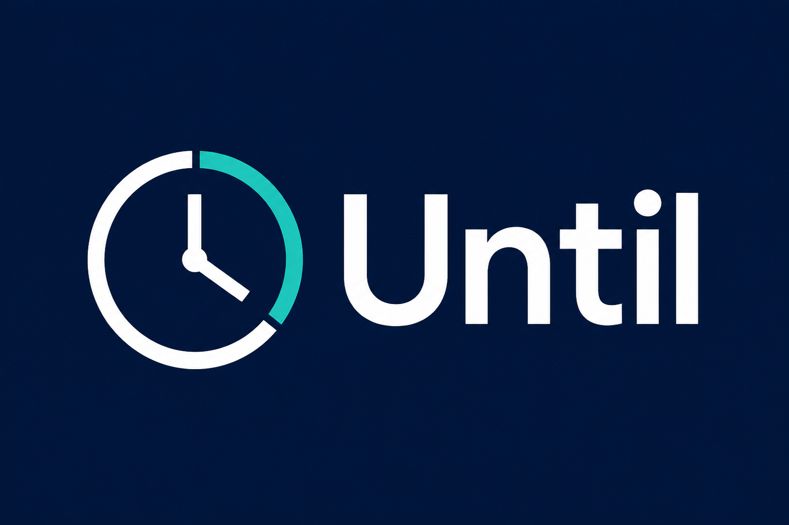

<div align="center">

  

  # Until

  **A simple, focused way to keep track of deadlines and time-bound events.**

  <p>
    <a href="#about">About</a> &middot;
    <a href="#installation">Installation</a> &middot;
    <a href="#project-status-and-goals">Roadmap</a> &middot;
    <a href="#contributing">Contributing</a>
  </p>

  <p>
    
    
    
    
    <a href="https://github.com/emidiomorgia/until/actions/workflows/ci.yml"></a>
    <a href="https://github.com/emidiomorgia/until/actions/workflows/cd.yml"></a>
    <a href="https://hub.docker.com/r/emidio78/until-frontend/tags"></a>
    <a href="LICENSE"></a>
  </p>

</div>

## Abstract

Deadlines are easy to miss when they are spread across calendars, notes, and task lists. **Until** is a lightweight web application for making time-bound commitments visible: create an event, see how much time remains, and keep important dates in one focused view.

The project is currently in pre-release development. The first public version will prioritize a small, reliable core experience over a large feature set.

## About

Until is a React and TypeScript single-page application built with [shadcn/ui](https://ui.shadcn.com/). Its interface is designed around clarity and quick scanning rather than complex project-management workflows.

The initial product direction is:

- create and manage deadlines or other time-bound events;
- display remaining time in a clear, human-friendly format;
- distinguish upcoming, due, and overdue events;
- provide a responsive experience for desktop and mobile screens; and
- keep the foundation modular so persistence, notifications, and integrations can be added later.

## Technical overview

The application is structured as a client-side React experience with TypeScript providing compile-time safety. UI primitives come from shadcn/ui and are intended to remain close to the application code, making visual changes easy to review and customize.

At a high level, the system will consist of:

| Layer | Responsibility |
| --- | --- |
| Presentation | Responsive screens, event lists, countdown states, forms, and empty states. |
| UI system | Accessible, composable components based on shadcn/ui. |
| Domain logic | Event creation, date/time calculations, validation, and due-state classification. |
| Persistence | Local or remote storage, to be finalized as the MVP implementation stabilizes. |

## Services

| Service | Public URL | CI quality gate | CD publication | Deployed version | Summary |
| --- | --- | --- | --- | --- | --- |
| Frontend | [until.morgia.info](https://until.morgia.info) | [CI workflow](https://github.com/emidiomorgia/until/actions/workflows/ci.yml) | [CD workflow](https://github.com/emidiomorgia/until/actions/workflows/cd.yml) | [Docker Hub semver tags](https://hub.docker.com/r/emidio78/until-frontend/tags) | React and TypeScript SPA landing page served from the published frontend image. |

### Render deployment

The production frontend is a Render Static Site configured by the root [`render.yaml`](render.yaml) Blueprint. When the Render service already exists, associating the repository or deploying a branch is not enough to apply Blueprint settings: the Blueprint must also be associated/synchronized with the existing service from the Render console. This applies the SPA rewrite (`/*` to `/index.html`) required for direct navigation to client-side routes such as `/app`.

The first release deliberately avoids prematurely committing to authentication, a backend, or third-party calendar synchronization. Those decisions will be made after the core workflow has been validated.

## Installation

### Prerequisites

- [Node.js](https://nodejs.org/) 18 or newer;
- npm 9 or newer, or an equivalent package manager; and
- Git.

The repository is still being scaffolded. Once the application source and `package.json` are present, use the platform-specific commands below from the repository root.

### macOS

```bash
git clone <repository-url>
cd until
npm install
npm run dev
```

Open the local URL printed by the development server, typically `http://localhost:5173`.

### Linux

```bash
git clone <repository-url>
cd until
npm install
npm run dev
```

If Node.js is not already installed, use your distribution's supported package manager or [nvm](https://github.com/nvm-sh/nvm) to install Node.js 18 or newer.

### Windows

In PowerShell:

```powershell
git clone <repository-url>
Set-Location until
npm install
npm run dev
```

You can also run the same commands from Git Bash. If PowerShell blocks npm scripts, use the Node.js installer's default shell or adjust the execution policy for your user account according to your organization's policy.

### Production build

```bash
npm run build
npm run preview
```

The exact build and preview scripts will be finalized with the first runnable release.

## Project status and goals

Until is not production-ready yet. The immediate goal is to publish **v0.1.0**, the first version with minimal but complete functionality.

| Goal | Status | Definition of done |
| --- | --- | --- |
| Publish v0.1.0 with minimal functionality | In progress | A user can create, view, update, and delete a time-bound event locally. |
| Countdown and due-state experience | Planned | Events clearly show remaining, due, and overdue states. |
| Responsive and accessible interface | In progress | Core flows work on mobile and desktop and are keyboard navigable. |
| Automated quality checks | Planned | Formatting, linting, type checking, and core tests run locally and in CI. |
| Durable persistence | Planned | Events survive a page refresh through a documented storage strategy. |
| Notifications and calendar integrations | Future | Optional reminders and import/export are designed without complicating the MVP. |

## Usage

The first release will document the primary workflow here with screenshots and examples. Until then, the intended flow is:

1. Add an event with a title and due date/time.
2. Review the event in the main timeline or list.
3. Use the remaining-time indicator to prioritize what needs attention.
4. Edit or remove the event when the commitment changes.

## Contributing

Contributions, documentation improvements, bug reports, and product feedback are welcome.

1. Fork the repository and create a focused branch from the default branch.
2. Make the smallest change that fully addresses the issue.
3. Run the available formatting, lint, type-check, and test commands locally.
4. Update the README or changelog when behavior or setup changes.
5. Open a pull request with a clear summary, testing notes, and screenshots for UI changes.

For larger changes, open an issue first so the approach can be discussed before implementation. Please keep pull requests focused and follow the project's existing style. By participating, you agree to collaborate respectfully and to license your contributions under the project's MIT license.

## Changelog

This project follows a lightweight versioning approach inspired by [Keep a Changelog](https://keepachangelog.com/en/1.1.0/).

### [Unreleased]

- Documentation and initial project foundation.
- Preparation for the v0.1.0 MVP release.

### [0.1.0] - Planned

- First public release with minimal deadline/event management functionality.

## Support and feedback

Use GitHub Issues for reproducible bugs, feature proposals, and questions. When reporting a bug, include your operating system, Node.js version, reproduction steps, and relevant console output.

## License

Until is distributed under the MIT License. See [LICENSE](LICENSE) for the full text.

## Acknowledgements

- [React](https://react.dev/) for the application framework.
- [TypeScript](https://www.typescriptlang.org/) for type safety.
- [shadcn/ui](https://ui.shadcn.com/) for accessible, composable UI foundations.
